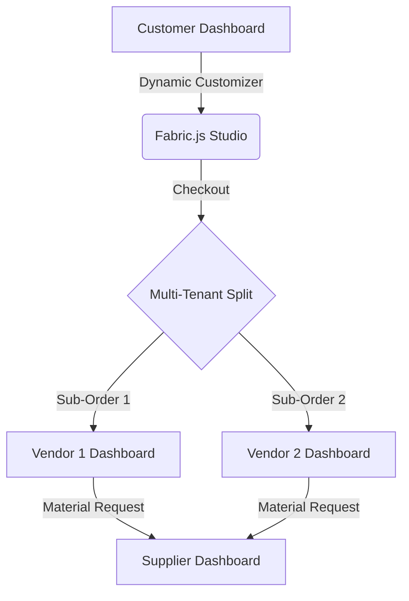

# Stitch3D Platform — Architecture & Codebase Improvement Report

Prepared for: Stitch3D Engineering Team  
Date: June 9, 2026  
Status: Comprehensive Technical Analysis (Static Review)

---

## Executive Summary
This report presents a thorough review of the Stitch3D multi-tenant custom leather design and commerce platform. The analysis focuses on ensuring code quality, security, system reliability, data consistency, and user experience. 

While the platform successfully integrates interactive features (such as the Fabric.js-based 3D/2D customizer canvas), several critical security vulnerabilities, database transaction risks, and architectural inconsistencies have been identified. 

Addressing these issues will elevate the codebase to industry-grade production standards, ensuring a seamless and reliable experience for customers, vendors, suppliers, and administrators.

---

## 1. Codebase Architecture & Code Quality

### 1.1 Inconsistent JWT Secrets (Security & Reliability Risk)
* **Status**: **Critical Warning**
* **Finding**: The JWT signing and verification secret key defaults to different values across the application modules if the environment variable `JWT_SECRET` is not set:
  * `src/lib/auth.js`: Defaults to `'supersecretkey'`
  * `src/app/api/auth/vendor/login/route.js`: Defaults to `'super_secret_stitch_key_2025'`
  * `src/app/api/admin/users/[id]/route.js`: Defaults to `'secret'`
  * `src/app/api/supplier/vendor-requests/[id]/accept-renegotiation/route.js`: Defaults to `'your_jwt_secret_key'`
* **Impact**: If deployed without environment variables, tokens signed by one portal (e.g., vendor login) will be rejected by other endpoints using different default keys, resulting in random authentication failures.
* **Recommendation**: 
  1. Centralize the JWT parsing and verification logic within `src/lib/auth.js`.
  2. Avoid hardcoding different fallback secrets in route files. Throw an explicit server configuration error if `process.env.JWT_SECRET` is undefined on startup.

### 1.2 Data Synchronization Drift in Duplicated Tables
* **Status**: **Important**
* **Finding**: The `vendors` table contains duplicate identity fields (`name`, `email`, `password`) that already exist in the `users` table. 
* **Impact**: 
  * In `src/app/api/vendor/settings/route.js`, updating a vendor’s email or company name only runs an `UPDATE` on the `vendors` table, leaving the linked `users` table email stale.
  * The vendor will subsequently be unable to log in with the new email because the user lookup queries the `users` table first.
* **Recommendation**:
  * Normalize the database structure. Remove `name`, `email`, and `password` columns from the `vendors` table.
  * Use a single source of truth (`users` table) for all credentials and user profile information, using the `vendors` table solely to store business-specific attributes (like `company_name`, `business_registration_number`) linked via a foreign key `user_id`.

### 1.3 Role Escalation and Broken Vendor Row Insertion
* **Status**: **Important**
* **Finding**: The general registration endpoint (`/api/auth/signup`) permits users to select any role (`customer`, `supplier`, `vendor`).
  * If a user registers as a vendor via this general route, the system creates a user and inserts an empty row in `vendors` containing only the `user_id`:
    ```javascript
    await db.query(`INSERT INTO vendors (user_id) VALUES (?)`, [userId]);
    ```
  * All other essential fields in the `vendors` table (such as `email` and `password`) remain `NULL`.
* **Impact**: The vendor is unable to log in because the vendor login API (`/api/auth/vendor/login`) queries the `vendors` table directly by email.
* **Recommendation**: 
  * Restrict `/api/auth/signup` exclusively to the `customer` role.
  * Force vendors to register solely through the `/api/auth/vendor/register` endpoint, and suppliers through a dedicated `/api/auth/supplier/register` endpoint to guarantee all required fields are validated and filled.

### 1.4 Fabric.js Script Injection Anti-Pattern
* **Status**: **Maintenance Improvement**
* **Finding**: In the Customizer page (`src/app/customer/customize/page.js`), Fabric.js is loaded dynamically by creating a client-side script tag referencing a CDN (v5.3.0), despite `fabric` (v6.9.0) being defined in `package.json`.
* **Impact**: 
  * Lack of static type checking and IDE autocompletion makes it difficult to maintain complex canvas logic.
  * Increases external dependency risks. If the CDN goes offline, the core studio feature breaks.
* **Recommendation**: 
  * Import Fabric.js locally using dynamic imports in Next.js (`next/dynamic` with `ssr: false`) to ensure it only loads on the client side without relying on external CDNs.

---

## 2. Database & Transaction Integrity

### 2.1 Lack of Database Transactions in Checkout Flow
* **Status**: **Critical Warning**
* **Finding**: The checkout endpoint (`/api/customer/orders/route.js`) handles order creation, item insertions, and vendor notification insertions in sequential, non-atomic queries:
  ```javascript
  const [orderResult] = await db.query(`INSERT INTO orders ...`);
  await db.query(`INSERT INTO order_items ...`);
  await db.query(`INSERT INTO notifications ...`);
  ```
* **Impact**: If the application crashes or database connection drops during item insertions, a blank parent order will be created without items, leaving the customer charged but the system with no record of what products to manufacture.
* **Recommendation**:
  * Wrap the entire order placement logic in a SQL transaction using MySQL2’s transaction capabilities:
    ```javascript
    const connection = await db.getConnection();
    try {
        await connection.beginTransaction();
        // Insert orders, items, and notifications...
        await connection.commit();
    } catch (error) {
        await connection.rollback();
        throw error;
    } finally {
        connection.release();
    }
    ```

### 2.2 Sequential SQL Queries inside Loops
* **Status**: **Performance Bottleneck**
* **Finding**: In `src/app/api/customer/complaints/route.js`, notifications for multiple admins are inserted inside a sequential `for` loop, causing separate database roundtrips:
  ```javascript
  const [admins] = await db.query("SELECT user_id FROM users WHERE role = 'admin'");
  for (const admin of admins) {
      await db.query("INSERT INTO notifications ...", [admin.user_id, ...]);
  }
  ```
* **Impact**: High latency and poor server performance as the number of admin accounts grows.
* **Recommendation**:
  * Bulk-insert notifications with a single query using nested arrays:
    ```javascript
    const notificationValues = admins.map(admin => [admin.user_id, 'admin', 'New Support Ticket', message, 'alert']);
    await db.query("INSERT INTO notifications (user_id, role, title, message, type) VALUES ?", [notificationValues]);
    ```

### 2.3 Fragile Schema Update System
* **Status**: **Maintenance Improvement**
* **Finding**: `src/lib/initDb.js` runs raw schema updates (`ALTER TABLE`) inside try-catch blocks to implement self-healing patches during startup.
* **Impact**: Makes tracking the state of the production database extremely difficult and increases startup overhead.
* **Recommendation**:
  * Replace the raw SQL startup script with a standardized database migration tool such as Prisma or Knex.js to manage schemas deterministically.

---

## 3. Security & Input Validation

### 3.1 Information Leakage via Stack Traces
* **Status**: **Vulnerability**
* **Finding**: Multiple API route handlers return raw database exception messages directly to the client:
  ```javascript
  } catch (error) {
      return NextResponse.json({ error: 'Order creation failed', details: error.message }, { status: 500 });
  }
  ```
* **Impact**: Exposes detailed database table names, SQL dialect, and constraint names to potential attackers, allowing them to map out vulnerabilities.
* **Recommendation**:
  * Log the detailed stack trace on the server console or tracking tool, and return a sanitized, user-friendly error message to the client (e.g., `"An unexpected error occurred while processing your order. Please contact support."`).

### 3.2 Absence of Request Payload Validation
* **Status**: **Vulnerability**
* **Finding**: Input payloads (e.g., checkout items, price renegotiations, complaints) are read from request JSON objects and directly passed to query parameters without validation of data types, ranges, or schemas.
* **Impact**: Users could manipulate items during checkout (e.g., submitting negative prices, non-integer quantities) or send malicious payload structures.
* **Recommendation**:
  * Integrate an input validation library (such as Yup or Zod) to validate and sanitize requests before interacting with the database.

---

## 4. User Experience (UX) & Workflow Improvements



### 4.1 Client-Side Unauthorized Flash (Dashboard Layouts)
* **Status**: **UX Flaw**
* **Finding**: Route protection is handled in client-side layouts (e.g., `src/app/admin/layout.js`) via a `useEffect` profile fetch.
* **Impact**: Unauthorized users can view the dashboard layout frame for a brief moment before the check completes and redirects them to the login page.
* **Recommendation**:
  * Implement Next.js **Middleware** (`middleware.js` in root) to intercept requests and inspect HTTP-only cookies or tokens before pages are sent to the browser.

### 4.2 Polling-Based Notifications vs. Real-Time WebSockets
* **Status**: **Performance & UX Improvement**
* **Finding**: The `NotificationBell` component uses client-side interval polling to retrieve new alerts from the server.
* **Impact**: Generates constant network traffic and database load even when the user is idle.
* **Recommendation**:
  * Migrate from polling to a push mechanism such as Server-Sent Events (SSE) or WebSockets. This achieves instantaneous notification alerts when vendor quotes or orders are accepted, without unnecessary DB queries.

### 4.3 Lockout/Dead Features in Admin Portal
* **Status**: **UX Improvement**
* **Finding**: The "Suppliers Management" navigation button in the Admin portal triggers a "Feature Locked: coming in FYP 2" modal.
* **Recommendation**:
  * Hide or grey out incomplete features. Displaying mock popups for basic CRUD panels decreases platform polish.

---

## Summary of Action Items

| Component | Issue | Priority | Resolution |
| :--- | :--- | :---: | :--- |
| **Authentication** | Mismatched Default JWT Secrets | **High** | Centralize secrets and validation inside `src/lib/auth.js`. |
| **Checkout API** | Lack of SQL Transactions | **High** | Wrap order and item creation in a transaction block. |
| **Settings API** | Vendor/User Email Sync Drift | **Medium** | Normalize credentials, update `users` table upon settings change. |
| **Signup API** | Role Escalation | **Medium** | Restrict general signup to customers; use specialized routes for vendors. |
| **Customizer Canvas** | CDN-Loaded Fabric.js | **Medium** | Bundle Fabric.js locally and load as dynamic component. |
| **API Responses** | Exposing Raw DB Error Details | **Medium** | Sanitize exception messages returned to the browser. |
| **Notifications** | API Polling Overhead | **Low** | Move from polling to WebSockets or Server-Sent Events (SSE). |

---

*End of Report.*
